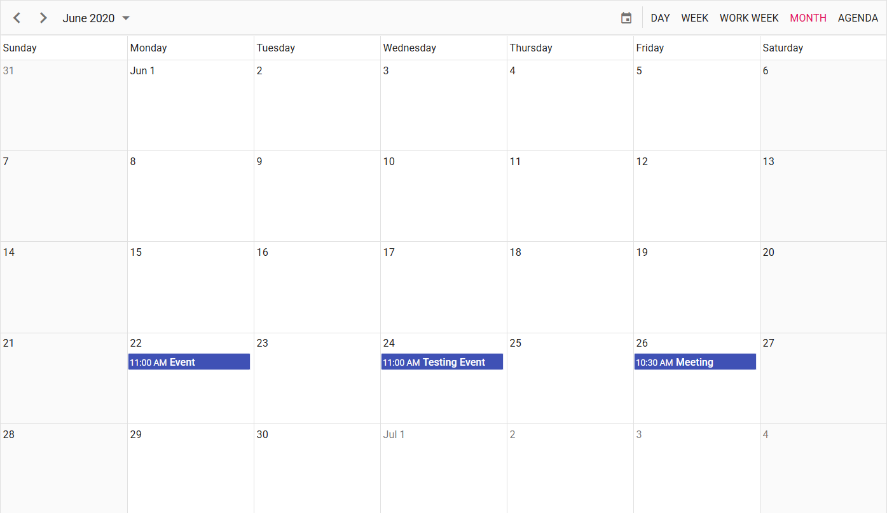
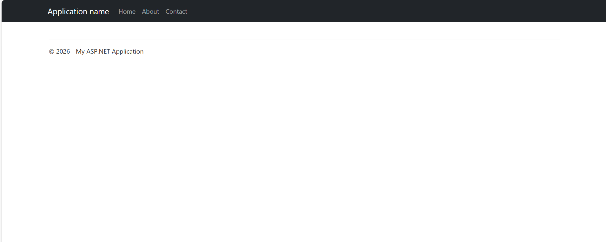

# Getting Started with React Scheduler Component using React and .Net application
## Description

This repository showcases a full‑stack sample application demonstrating how to integrate the Syncfusion React Scheduler component into a React application that communicates with a .NET backend using Axios.<br />
The .NET API provides REST endpoints for managing calendar events stored on the server, while the React frontend delivers a responsive scheduling interface that enables users to create, update, view, and delete events seamlessly through the Syncfusion Scheduler.

<br />

## Setup
- Clone the repository to your local machine.

<br />

### Backend Setup
refer `README.md` present inside `Backend-DotNet`

<br />

### Frontend Setup
refer `README.md` present inside `Frontend-React`

<br />

## Running the Application

#### <u> Backend Server </u>
1. Make sure that we had completed the `backend setup` mentioned above. 
2. Start the backend server from Visual Studio.
    - Press F5 or Click the debug symbol manually.
3. Server started running on the http://localhost:54738.


#### <u> Frontend Application </u>
1. Make sure that we had completed the `frontend setup` mentioned above. 
2. Navigate to the react project folder `Frontend-React/`.
3. Start the frontend:
    ```bash
    npm start
    ```
4. Navigate to [http://localhost:3000](http://localhost:3000) in your browser.<br />
    The page will reload if you make edits.<br />
    You will also see any lint errors in the console.

<br />

## Sample Outputs

*Image illustrating the Syncfusion React Scheduler* 


*Image illustrating the .Net server application* 


*Image illustrating the records in the DB* 

<br />

## Troubleshooting
- **404 PageNotFound**: Ensure the backend server running on `localhost:54738`.
- **CORS errors**: Ensure the frontend running on `localhost:3000`.
- If you face any issue in .Net server application, rebuild solution. (`visual studio -> build -> rebuild solution`)